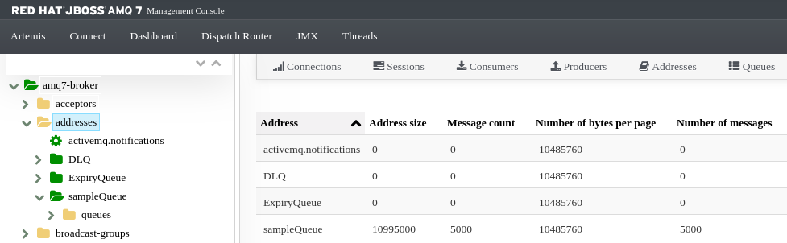

# Migrate Red Hat JBoss A-MQ 6.3 to Red Hat AMQ 7.2 on OpenShift using Ansible

This repo demonstrates how to migrate your Messaging Brokers deployed in OpenShift from Red Hat JBoss A-MQ 6.3 to
Red Hat JBoss AMQ 7.3. This migration includes:

* Zero down-time in your current Messaging Services.
* Move any persisted message from previous broker to the new one.
* Automated with an Ansible Role

Red Hat AMQ 7.2 is the latest version of a high performance, scalable and multi-protocol broker 
based on [Apache ActiveMQ Artemis](http://activemq.apache.org/components/artemis/). It is available as a 
containerized image for use with OpenShift Container Platform so it allows you to quickly deploy messaging services 
in a cloud environment.

## Migration Process

Migration process is very straight forward in OpenShift because we could use the drainer pod to move any persisted message
from KahaDB storage to new brokers. Services are also patched to select the new Red Hat AMQ 7 pods.

Basically the migration steps are:

1. Scale up Red Hat AMQ 7 broker and wait to be ready.
2. Patch Red Hat A-MQ 6 Services to balance connections to Red Hat AMQ 7 Broker Pods.
3. Scale down Red Hat A-MQ 6 drainer (*It will be started later*).
4. Scale down Red Hat A-MQ 6 Broker to avoid new connections. New connections will be to the new Red Hat AMQ 7 broker.
5. Scale up Red Hat A-MQ 6 Drainer to drain messages to new Red Hat AMQ 7 broker.
6. Check Red Hat A-MQ 6 Drainer concluded two migration cycles. If after two cycles there are not messages to migrate, we can
confirm that drainer finished successfully.
7. Scale down Red Hat A-MQ 6 Drainer after finished migration

As Red Hat AMQ 7 provides *OpenWire* protocol, Red Hat A-MQ 6 drainer can connect with it and creates a Cluster Connection
to move any messages. We could do it easily in OpenShift because this service is provided by Red Hat A-MQ 6 persisted brokers.

## Ansible Playbook

This Ansible Project includes an [Ansible Playbooks](http://docs.ansible.com/ansible/playbooks.html):

* [migration-amq6-to-amq7.yml](./migration-amq6-to-amq7.yml): Migrate Messaging Services from Red Hat A-MQ 6 to Red Hat AMQ 7

This playbook makes use of the following [Ansible Roles](https://docs.ansible.com/ansible/latest/user_guide/playbooks_reuse_roles.html):

* [ocp-get-token](./roles/ocp-get-token): API call to get OpenShift access token for a particular OCP username and password.
* [migration-amq6-to-amq7](./roles/migration-amq6-to-amq7): Migrate Messaging services from Red Hat A-MQ 6 to Red Hat AMQ 7.

Ansible Roles are documented in their corresponding directories.

## Ansible Requirements

This playbook has been tested with the following Ansible versions:

```
ansible 2.7.7
ansible 2.7.8
ansible 2.7.10
```

To install Ansible on a RHEL based system:

```
yum install ansible -y
```

## Sample Test

You can test this process easily using an OpenShift cluster to deploy a Red Hat A-MQ 6 and Red Hat AMQ 7 broker and
migrate messages persisted.

If you do not have a OpenShift cluster you could try to use a local environment using one of the following resources:

* [minishift - run OpenShift locally](https://github.com/minishift/minishift)
* [Red Hat Container Development Kit](https://developers.redhat.com/products/cdk/overview/)
* [minikube - Running Kubernetes Locally](https://kubernetes.io/docs/setup/minikube/)

### Prepare your Environment

To deploy Red Hat A-MQ 6 and Red Hat AMQ 7 brokers there are a set of images and templates provided by Red Hat. Usually
they are installed with OpenShift, however it you have not found in your OpenShift cluster, this section describes
how to install them.

*NOTE*: To install images and templates in ```openshift``` namespace your user should be cluster-admin or have granted
permissions. 

As **developer** user you could create a new project to deploy both brokers:

```
$ oc login -u developer -p developer
$ oc new-project amq6-to-amq7
```

#### Red Hat JBoss A-MQ 6.3 Images and Templates

To install Red Hat A-MQ 6 Image Streams in ```openshift``` namespace:

```
$ oc replace --force -n openshift -f \
    https://raw.githubusercontent.com/jboss-openshift/application-templates/master/amq/amq63-image-stream.json
$ oc import-image jboss-amq-63:1.4 -n openshift 
```

To install Red Hat A-MQ 6 templates in ```openshift``` namespace:

```
for template in amq63-persistent-ssl.json amq63-basic.json amq63-ssl.json amq63-persistent.json;
  do
     oc create -n openshift -f \
       https://raw.githubusercontent.com/jboss-openshift/application-templates/ose-v1.4.15/amq/${template}
     oc replace -n openshift -f \
       https://raw.githubusercontent.com/jboss-openshift/application-templates/ose-v1.4.15/amq/${template}
done
```

More information at [Red Hat JBoss A-MQ for OpenShift](https://access.redhat.com/documentation/en-us/red_hat_jboss_a-mq/6.3/html-single/red_hat_jboss_a-mq_for_openshift/index)

#### Red Hat AMQ 7.2 Images and Templates

To install Red Hat AMQ 7 Image Streams in ```openshift``` namespace:

```
$ oc replace --force -n openshift -f \
  https://raw.githubusercontent.com/jboss-container-images/jboss-amq-7-broker-openshift-image/72-1.2.GA/amq-broker-7-image-streams.yaml
$ oc replace --force -n openshift -f \
  https://raw.githubusercontent.com/jboss-container-images/jboss-amq-7-broker-openshift-image/72-1.2.GA/amq-broker-7-scaledown-controller-image-streams.yaml
$ oc import-image amq-broker-72-openshift:1.2 -n openshift
$ oc import-image amq-broker-72-scaledown-controller-openshift:1.0 -n openshift
```

To install Red Hat AMQ 7 templates in ```openshift``` namespace:

```
for template in \
    amq-broker-72-basic.yaml amq-broker-72-ssl.yaml amq-broker-72-custom.yaml amq-broker-72-persistence.yaml \
    amq-broker-72-persistence-ssl.yaml amq-broker-72-persistence-clustered.yaml amq-broker-72-persistence-clustered-ssl.yaml;
  do
    oc replace --force -n openshift -f \
      https://raw.githubusercontent.com/jboss-container-images/jboss-amq-7-broker-openshift-image/72-1.2.GA/templates/${template}
done
```

More information at [Deploying Red Hat AMQ 7 broker on OpenShift](https://access.redhat.com/documentation/en-us/red_hat_amq/7.2/html-single/deploying_amq_broker_on_openshift_container_platform/index)

### Deploy Red Hat A-MQ 6.3 broker

* Create ServiceAccount and add **view** role:

```
$ echo '{"kind": "ServiceAccount", "apiVersion": "v1", "metadata": {"name": "amq-sa"}}' | oc create -f -
$ oc policy add-role-to-user view system:serviceaccount:$(oc project -q):amq-sa
```

* Deploy broker using ```amq63-persistent``` template and add ServiceAccount created:

```
$ oc process openshift//amq63-persistent -p APPLICATION_NAME=broker -p MQ_USERNAME=admin -p MQ_PASSWORD=admin -p MQ_PROTOCOL=openwire,amqp,stomp,mqtt | oc create -f -
$ oc patch dc broker-amq -p '{"spec":{"template":{"spec":{"serviceAccount": "amq-sa","serviceAccountName": "amq-sa"}}}}'
$ oc patch dc broker-drainer -p '{"spec":{"template":{"spec":{"serviceAccount": "amq-sa","serviceAccountName": "amq-sa"}}}}'
```

* Send messages to a sample queue. These messages should be moved to Red Hat AMQ 7 broker during migration process:

```
$ oc rsh broker-amq-1-ptqnw /opt/amq/bin/activemq producer --brokerUrl tcp://localhost:61616 --user admin --password admin --destination queue://sampleQueue --messageCount 5000 --message "Sample message"
```

**NOTE**: To identify broker pod you could use ```oc get pod``` command.

### Deploy Red Hat AMQ 7 broker

* Deploy broker using ```amq-broker-72-persistence-clustered``` template:

```
oc process openshift//amq-broker-72-persistence-clustered -p APPLICATION_NAME=amq7-broker -p AMQ_NAME=amq7-broker -p AMQ_USER=admin -p AMQ_PASSWORD=admin -p AMQ_REPLICAS=1 | oc create -f -
```

* Expose administrative route:

```
oc expose svc amq7-broker-amq-headless --port=8161
```

* Deploy Scaledown controller:

```
oc create -f https://raw.githubusercontent.com/jboss-container-images/jboss-amq-7-broker-openshift-image/72-1.2.GA/templates/amq-broker-72-persistence-clustered-controller.yaml
```

## Migrate using Ansible Playbook

To execute the migration ansible playbook:

```
$ ansible-playbook -c local migration-amq6-to-amq7.yml 
Enter OCP Master URL: https://master.example.org:8443
Enter OCP username: developer
Enter OCP password: openshift
...
Saturday 20 April 2019  09:28:55 +0200 (0:01:01.895)       0:04:23.196 ******** 
=============================================================================== 
migration-amq6-to-amq7 : [oc] Wait for AMQ 6 Drainer is terminated ------------------------------------------------------------------------------------------------------------------------------------------------------------------------------------ 91.73s
migration-amq6-to-amq7 : [oc] Wait for AMQ 6 Drainer is terminated ------------------------------------------------------------------------------------------------------------------------------------------------------------------------------------ 61.90s
migration-amq6-to-amq7 : [oc] Check AMQ 6 Drainer concluded two migration cycles ---------------------------------------------------------------------------------------------------------------------------------------------------------------------- 61.80s
migration-amq6-to-amq7 : [oc] Wait for AMQ 6 Drainer is ready ----------------------------------------------------------------------------------------------------------------------------------------------------------------------------------------- 31.06s
migration-amq6-to-amq7 : [oc] Patch AMQ 6 Services to balance connections to AMQ 7 Broker Pods --------------------------------------------------------------------------------------------------------------------------------------------------------- 1.87s
migration-amq6-to-amq7 : [oc] Check AMQ 6 Drainer concluded two migration cycles ----------------------------------------------------------------------------------------------------------------------------------------------------------------------- 0.81s
migration-amq6-to-amq7 : [oc] Scale up AMQ 6 Drainer to drain messages --------------------------------------------------------------------------------------------------------------------------------------------------------------------------------- 0.59s
migration-amq6-to-amq7 : [oc] Scale down AMQ 6 Drainer after finished migration ------------------------------------------------------------------------------------------------------------------------------------------------------------------------ 0.51s
migration-amq6-to-amq7 : [oc] Scale down AMQ 6 Broker to avoid new connections ------------------------------------------------------------------------------------------------------------------------------------------------------------------------- 0.44s
migration-amq6-to-amq7 : [oc] Scale down AMQ 6 Drainer to avoid drain messages ------------------------------------------------------------------------------------------------------------------------------------------------------------------------- 0.42s
migration-amq6-to-amq7 : [oc] Scale up AMQ 7 Broker ---------------------------------------------------------------------------------------------------------------------------------------------------------------------------------------------------- 0.39s
migration-amq6-to-amq7 : [oc] Scale up AMQ 7 Scale Down Controller ------------------------------------------------------------------------------------------------------------------------------------------------------------------------------------- 0.38s
migration-amq6-to-amq7 : [oc] Wait for AMQ 7 Broker is ready ------------------------------------------------------------------------------------------------------------------------------------------------------------------------------------------- 0.35s
ocp-get-token : [shell] Curl GET OpenShift Session Token ----------------------------------------------------------------------------------------------------------------------------------------------------------------------------------------------- 0.31s
[include_role] Role Name: migration-amq6-to-amq7 ------------------------------------------------------------------------------------------------------------------------------------------------------------------------------------------------------- 0.05s
[include_role] Role Name: ocp-get-token ---------------------------------------------------------------------------------------------------------------------------------------------------------------------------------------------------------------- 0.05s
ocp-get-token : [set_fact] Basic Auth from User and Password ------------------------------------------------------------------------------------------------------------------------------------------------------------------------------------------- 0.04s
[include_vars] Include Vars namespaces.yml ------------------------------------------------------------------------------------------------------------------------------------------------------------------------------------------------------------- 0.04s
ocp-get-token : [set_fact] Base64 Encode Basic Auth ---------------------------------------------------------------------------------------------------------------------------------------------------------------------------------------------------- 0.04s
ocp-get-token : [set_fact] Set ocp_token variable ------------------------------------------------------------------------------------------------------------------------------------------------------------------------------------------------------ 0.03s
```

After that migration your Red Hat AMQ 7 broker has the same number of messages from previous broker. You could review
drainer pod log to confirm that messages were moved. There is a sample [drainer log](./drainer-sample.log)

From Red Hat AMQ 7 Management Console you could confirm it as you can see on the next screenshoot:


